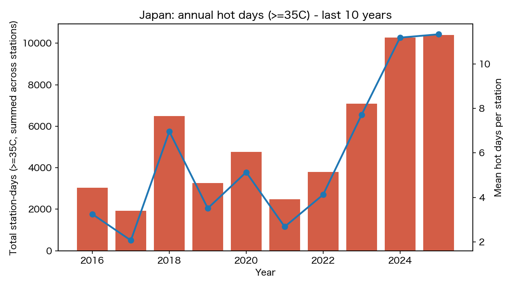
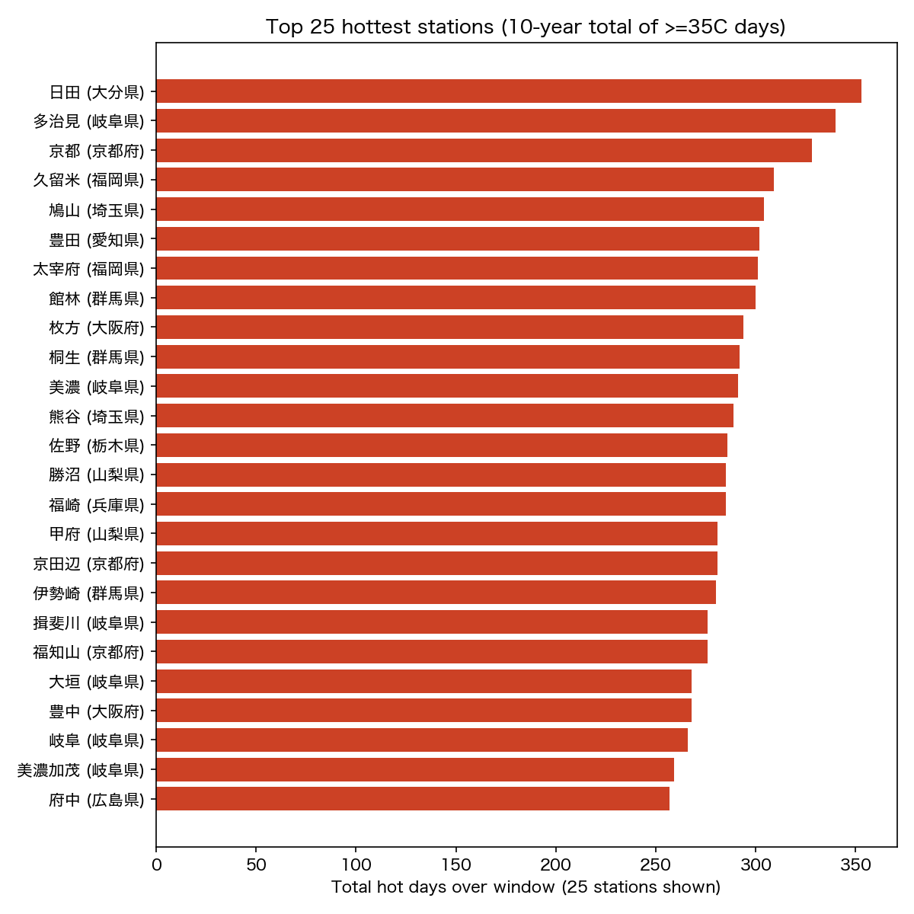
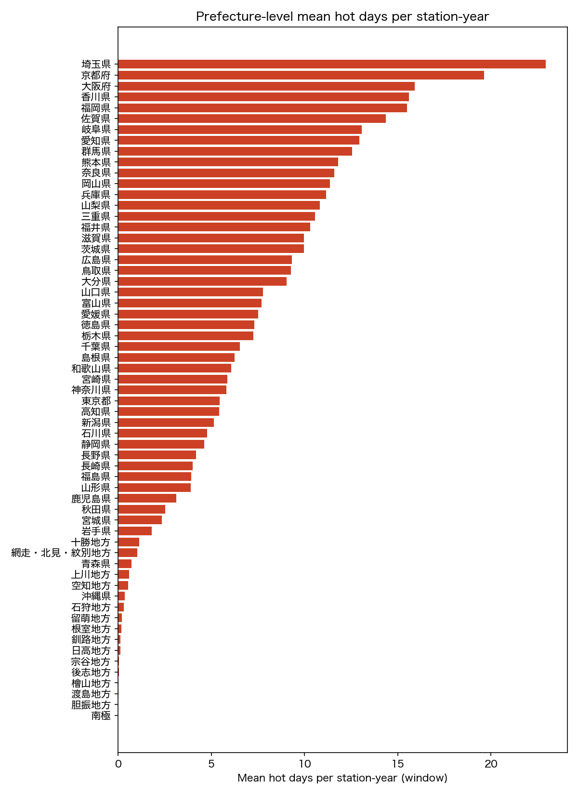

# JMA extreme hot days (>=35C) - 2016-2025

## Coverage
- Stations in catalog: **1678**
- Stations with at least one parsed hot-day value in window: **941**

## National annual trend

|    year |   stations_reporting |   total_station_days |   mean_per_station |   median_per_station |
|--------:|---------------------:|---------------------:|-------------------:|---------------------:|
| 2016.00 |               933.00 |              3027.00 |               3.24 |                 0.00 |
| 2017.00 |               934.00 |              1930.00 |               2.07 |                 0.00 |
| 2018.00 |               932.00 |              6487.00 |               6.96 |                 2.00 |
| 2019.00 |               931.00 |              3267.00 |               3.51 |                 1.00 |
| 2020.00 |               930.00 |              4772.00 |               5.13 |                 2.00 |
| 2021.00 |               927.00 |              2484.00 |               2.68 |                 1.00 |
| 2022.00 |               920.00 |              3790.00 |               4.12 |                 1.00 |
| 2023.00 |               919.00 |              7084.00 |               7.71 |                 3.00 |
| 2024.00 |               919.00 |             10273.00 |              11.18 |                 3.00 |
| 2025.00 |               919.00 |             10411.00 |              11.33 |                 5.00 |

## Top 25 hottest stations (10-year total)

| name   | pref_name   | kind   |   total_hot_days |   mean_hot_days |   max_hot_days |   years_with_data |
|:-------|:------------|:-------|-----------------:|----------------:|---------------:|------------------:|
| 日田     | 大分県         | s      |           353.00 |           35.30 |          62.00 |                10 |
| 多治見    | 岐阜県         | a      |           340.00 |           34.00 |          59.00 |                10 |
| 京都     | 京都府         | s      |           328.00 |           32.80 |          61.00 |                10 |
| 久留米    | 福岡県         | a      |           309.00 |           30.90 |          54.00 |                10 |
| 鳩山     | 埼玉県         | a      |           304.00 |           30.40 |          51.00 |                10 |
| 豊田     | 愛知県         | a      |           302.00 |           30.20 |          57.00 |                10 |
| 太宰府    | 福岡県         | a      |           301.00 |           30.10 |          62.00 |                10 |
| 館林     | 群馬県         | a      |           300.00 |           30.00 |          54.00 |                10 |
| 枚方     | 大阪府         | a      |           294.00 |           29.40 |          51.00 |                10 |
| 桐生     | 群馬県         | a      |           292.00 |           29.20 |          58.00 |                10 |
| 美濃     | 岐阜県         | a      |           291.00 |           29.10 |          57.00 |                10 |
| 熊谷     | 埼玉県         | s      |           289.00 |           28.90 |          53.00 |                10 |
| 佐野     | 栃木県         | a      |           286.00 |           28.60 |          49.00 |                10 |
| 勝沼     | 山梨県         | a      |           285.00 |           28.50 |          50.00 |                10 |
| 福崎     | 兵庫県         | a      |           285.00 |           28.50 |          56.00 |                10 |
| 甲府     | 山梨県         | s      |           281.00 |           28.10 |          59.00 |                10 |
| 京田辺    | 京都府         | a      |           281.00 |           28.10 |          60.00 |                10 |
| 伊勢崎    | 群馬県         | a      |           280.00 |           28.00 |          51.00 |                10 |
| 揖斐川    | 岐阜県         | a      |           276.00 |           27.60 |          53.00 |                10 |
| 福知山    | 京都府         | a      |           276.00 |           27.60 |          58.00 |                10 |
| 大垣     | 岐阜県         | a      |           268.00 |           26.80 |          58.00 |                10 |
| 豊中     | 大阪府         | a      |           268.00 |           26.80 |          47.00 |                10 |
| 岐阜     | 岐阜県         | s      |           266.00 |           26.60 |          51.00 |                10 |
| 美濃加茂   | 岐阜県         | a      |           259.00 |           25.90 |          51.00 |                10 |
| 府中     | 広島県         | a      |           257.00 |           25.70 |          57.00 |                10 |

## Prefecture-level summary

|   prec_no | pref_name   |   total_hot_days |   mean_hot_days_per_station_year |   max_station_year |   station_year_obs |
|----------:|:------------|-----------------:|---------------------------------:|-------------------:|-------------------:|
|        52 | 岐阜県         |          3006.00 |                            13.07 |              59.00 |                230 |
|        63 | 兵庫県         |          2231.00 |                            11.15 |              56.00 |                200 |
|        82 | 福岡県         |          2168.00 |                            15.49 |              62.00 |                140 |
|        86 | 熊本県         |          2150.00 |                            11.81 |              53.00 |                182 |
|        43 | 埼玉県         |          1835.00 |                            22.94 |              53.00 |                 80 |
|        66 | 岡山県         |          1816.00 |                            11.35 |              56.00 |                160 |
|        67 | 広島県         |          1770.00 |                             9.32 |              57.00 |                190 |
|        42 | 群馬県         |          1630.00 |                            12.54 |              58.00 |                130 |
|        61 | 京都府         |          1571.00 |                            19.64 |              61.00 |                 80 |
|        51 | 愛知県         |          1553.00 |                            12.94 |              57.00 |                120 |
|        54 | 新潟県         |          1462.00 |                             5.13 |              37.00 |                285 |
|        40 | 茨城県         |          1455.00 |                             9.97 |              51.00 |                146 |
|        62 | 大阪府         |          1431.00 |                            15.90 |              51.00 |                 90 |
|        83 | 大分県         |          1357.00 |                             9.05 |              62.00 |                150 |
|        53 | 三重県         |          1268.00 |                            10.57 |              48.00 |                120 |
|        48 | 長野県         |          1257.00 |                             4.18 |              42.00 |                301 |
|        81 | 山口県         |          1243.00 |                             7.77 |              50.00 |                160 |
|        36 | 福島県         |          1220.00 |                             3.91 |              34.00 |                312 |
|        49 | 山梨県         |          1191.00 |                            10.83 |              59.00 |                110 |
|        68 | 島根県         |          1188.00 |                             6.25 |              47.00 |                190 |
|        73 | 愛媛県         |          1128.00 |                             7.52 |              36.00 |                150 |
|        72 | 香川県         |          1092.00 |                            15.60 |              54.00 |                 70 |
|        88 | 鹿児島県        |          1030.00 |                             3.12 |              40.00 |                330 |
|        57 | 福井県         |          1030.00 |                            10.30 |              43.00 |                100 |
|        41 | 栃木県         |          1023.00 |                             7.26 |              49.00 |                141 |
|        87 | 宮崎県         |          1003.00 |                             5.87 |              42.00 |                171 |
|        44 | 東京都         |           979.00 |                             5.44 |              48.00 |                180 |
|        45 | 千葉県         |           978.00 |                             6.52 |              40.00 |                150 |
|        69 | 鳥取県         |           927.00 |                             9.27 |              39.00 |                100 |
|        50 | 静岡県         |           898.00 |                             4.63 |              41.00 |                194 |
|        60 | 滋賀県         |           898.00 |                             9.98 |              47.00 |                 90 |
|        74 | 高知県         |           869.00 |                             5.43 |              50.00 |                160 |
|        85 | 佐賀県         |           861.00 |                            14.35 |              47.00 |                 60 |
|        35 | 山形県         |           858.00 |                             3.90 |              28.00 |                220 |
|        84 | 長崎県         |           769.00 |                             4.01 |              50.00 |                192 |
|        55 | 富山県         |           769.00 |                             7.69 |              37.00 |                100 |
|        65 | 和歌山県        |           729.00 |                             6.08 |              45.00 |                120 |
|        64 | 奈良県         |           696.00 |                            11.60 |              51.00 |                 60 |
|        32 | 秋田県         |           657.00 |                             2.53 |              26.00 |                260 |
|        33 | 岩手県         |           637.00 |                             1.81 |              21.00 |                352 |
|        71 | 徳島県         |           591.00 |                             7.30 |              49.00 |                 81 |
|        56 | 石川県         |           525.00 |                             4.77 |              27.00 |                110 |
|        34 | 宮城県         |           490.00 |                             2.36 |              17.00 |                208 |
|        46 | 神奈川県        |           290.00 |                             5.80 |              28.00 |                 50 |
|        17 | 網走・北見・紋別地方  |           228.00 |                             1.04 |               9.00 |                220 |
|        20 | 十勝地方        |           214.00 |                             1.13 |               7.00 |                190 |
|        31 | 青森県         |           166.00 |                             0.72 |              16.00 |                230 |
|        12 | 上川地方        |           135.00 |                             0.59 |              10.00 |                230 |
|        91 | 沖縄県         |            97.00 |                             0.37 |               8.00 |                265 |
|        15 | 空知地方        |            56.00 |                             0.54 |               6.00 |                104 |
|        14 | 石狩地方        |            30.00 |                             0.30 |               3.00 |                100 |
|        13 | 留萌地方        |            18.00 |                             0.20 |              10.00 |                 90 |
|        19 | 釧路地方        |            16.00 |                             0.13 |               2.00 |                120 |
|        18 | 根室地方        |            15.00 |                             0.17 |               2.00 |                 90 |
|        22 | 日高地方        |             9.00 |                             0.11 |               3.00 |                 80 |
|        11 | 宗谷地方        |             6.00 |                             0.05 |               3.00 |                130 |
|        16 | 後志地方        |             4.00 |                             0.04 |               1.00 |                110 |
|        24 | 檜山地方        |             1.00 |                             0.02 |               1.00 |                 60 |
|        23 | 渡島地方        |             1.00 |                             0.01 |               1.00 |                100 |
|        21 | 胆振地方        |             0.00 |                             0.00 |               0.00 |                110 |
|        99 | 南極          |             0.00 |                             0.00 |               0.00 |                 10 |

## Notes

- Source: 気象庁 過去の気象データ (https://www.data.jma.go.jp/obd/stats/etrn/).
- '猛暑日' is JMA's official term for a day with daily maximum temperature >= 35 degC.
- AMeDAS-only stations and stations newly installed within the window may have shorter coverage; see `years_with_data` per station.
- Values flagged with ')' or similar in JMA tables indicate incomplete monthly aggregation; they are kept as-is in this dataset with the original flag preserved in the `flag` column.
## 猛暑日ゼロの観測地点（2016〜2025年）

10年間を通じて一度も猛暑日（最高気温35°C以上）を記録しなかった観測地点は、データのある1,321地点中 **153地点**（11.6%）あった。

### カテゴリ別内訳

| カテゴリ | 地点数 | 代表的な地点 |
|--------|--------|------------|
| 北海道（沿岸・道東） | 73 | 稚内、釧路、根室、室蘭、苫小牧、えりも岬 |
| 沿海・離島 | 29 | 勝浦（千葉）、宮古島（沖縄）、父島（東京）、室戸岬（高知） |
| 東北（高地・内陸寒冷地） | 24 | 酸ケ湯（青森）、薮川（岩手）、桧枝岐（福島） |
| 高原・山岳 | 24 | 富士山（静岡・山梨）、軽井沢（長野）、草津（群馬）、阿蘇山（熊本） |
| 南極 | 1 | 昭和基地 |

### 主な分析

**北海道（73件）** が最多。道央〜道東のオホーツク海・太平洋側は夏の冷涼な海霧（やませ）の影響を受けるため、真夏でも35°Cに達することがほとんどない。胆振地方・釧路地方が丸ごと0件。

**沿海・離島（29件）** の内訳は多様。
- *沖縄の離島*（宮古島・南大東島など）は南国でありながら猛暑日ゼロ。最高気温が33〜34°C止まりで海洋性気候が気温上昇を抑制する。
- *千葉・勝浦*は「避暑地」として知られ、南東海風と太平洋の冷水が35°C超えを防ぐ。
- *室戸岬（高知）・石廊崎（静岡）*など岬の観測点も同様。

**高原・山岳（24件）** は標高が決定的。軽井沢（約950m）・野辺山（約1,350m）・菅平（約1,340m）・草津（約1,220m）はリゾート避暑地として名高く、高地のため気温が35°Cに届かない。富士山（3,776m）は論外として、奥日光（約1,272m）・那須高原・阿蘇山頂も同様。

**東北（24件）** の多くは標高の高い山間部や下北半島〜津軽海峡沿いの地点。酸ケ湯（青森）は豪雪地帯としても知られ、夏も冷涼。

### 猛暑日ゼロ地点の全リスト

| 地点名 | 所在 | 種別 | 観測年数 |
|--------|------|------|--------|
| 昭和 | 南極 | 有人 | 10 |
| 富士山 | 山梨県／静岡県 | 有人 | 10 |
| 軽井沢 | 長野県 | 有人 | 10 |
| 稚内 | 宗谷地方 | 有人 | 10 |
| 北見枝幸 | 宗谷地方 | 有人 | 10 |
| 根室 | 根室地方 | 有人 | 10 |
| 釧路 | 釧路地方 | 有人 | 10 |
| 室蘭 | 胆振地方 | 有人 | 10 |
| 苫小牧 | 胆振地方 | 有人 | 10 |
| 浦河 | 日高地方 | 有人 | 10 |
| 羽幌 | 留萌地方 | 有人 | 10 |
| 倶知安 | 後志地方 | 有人 | 10 |
| 寿都 | 後志地方 | 有人 | 10 |
| 江差 | 檜山地方 | 有人 | 10 |
| 奥日光（日光） | 栃木県 | 有人 | 10 |
| 勝浦 | 千葉県 | 有人 | 10 |
| 三宅島 | 東京都 | 有人 | 10 |
| 南鳥島 | 東京都 | 有人 | 10 |
| 父島 | 東京都 | 有人 | 10 |
| 石廊崎 | 静岡県 | 有人 | 10 |
| 宮古島 | 沖縄県 | 有人 | 10 |
| 南大東（南大東島） | 沖縄県 | 有人 | 10 |
| 室戸岬 | 高知県 | 有人 | 10 |
| 平戸 | 長崎県 | 有人 | 10 |
| 雲仙岳 | 長崎県 | 有人 | 10 |
| 沖永良部 | 鹿児島県 | 有人 | 10 |
| 阿蘇山 | 熊本県 | 有人 | 2 |
| 酸ケ湯 | 青森県 | AMeDAS | 10 |
| 菅平 | 長野県 | AMeDAS | 10 |
| 野辺山 | 長野県 | AMeDAS | 10 |
| 草津 | 群馬県 | AMeDAS | 10 |
| えりも岬 | 日高地方 | AMeDAS | 10 |
| 宗谷岬 | 宗谷地方 | AMeDAS | 10 |
| 薮川 | 岩手県 | AMeDAS | 10 |
| 桧枝岐 | 福島県 | AMeDAS | 10 |
| 占冠 | 上川地方 | AMeDAS | 10 |
| 朱鞠内 | 上川地方 | AMeDAS | 10 |
| ぬかびら源泉郷 | 十勝地方 | AMeDAS | 10 |
| 支笏湖畔 | 石狩地方 | AMeDAS | 10 |
| 高野山 | 和歌山県 | AMeDAS | 10 |
| 生駒山 | 大阪府 | AMeDAS | 10 |
| 白馬 | 長野県 | AMeDAS | 10 |
| 開田高原 | 長野県 | AMeDAS | 10 |
| （他118地点） | 北海道・東北・離島ほか | AMeDAS | — |
